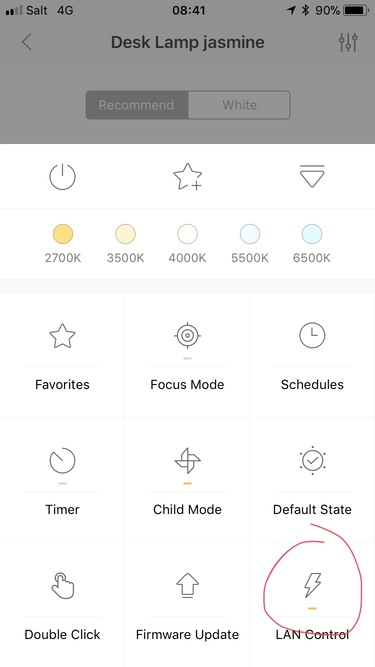

# Yeelight control
#### Video Demo:  <URL HERE>
#### Description:
This app allows the user to control smart devices (lightbulbs) from the desktop. Yeelight control is written in python
and is corssplatform. It comes with a GUI ! 
#### Features :
* Toogle on/off the light
* Select color with the help of a color chooser
* Select presets ("flows")
* User friendly slider to set the brightness
* Quick access to three different white lights
* Support for multiples lightbulbs, they are not hardcoded, user can define which lightbulb to control

#### Usage :
1. Enable lan control on yeelight app 
2. 
3. Then write down the IP address of your lightbulb (in the settings of yeelight).
4. You need to update python to the latest version to avoid any bugs, you can get it [there](https://www.python.org/downloads/)
in case there is any bug use [python 3.9.6](https://www.python.org/downloads/release/python-396/).
5. Then you have to install the dependencies, open the command prompt on Windows or the terminal on MacOS/Linux and 
type : `pip install yeelight` or `python -m pip install yeelight ` if the first one does not work. If anything goes wrong make
sure python is installed and refer to the Installation section [here](https://gitlab.com/stavros/python-yeelight).
6. Finally, navigate to the path of the file and use `python3 main.py` to launch the app.

#### Acknowledgments :
* [python-yeelight](https://gitlab.com/stavros/python-yeelight)
* [Yeelight](https://us.yeelight.com/)
* [Figma](https://www.figma.com/)